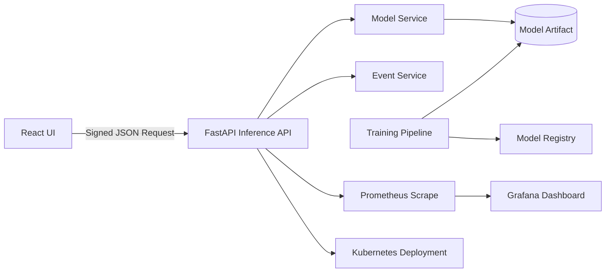

# MLOps Production Pipeline

A production-grade, full-stack MLOps platform that delivers secure real-time credit risk inference, model lifecycle workflows, observability, and infrastructure-as-code for scalable deployment.

## Problem Statement

Financial decision systems require low-latency model inference, traceability, controlled model promotions, and operational visibility. Teams frequently struggle with fragmented tooling, weak deployment discipline, and limited monitoring, causing outages and model risk.

## Solution

This repository implements an end-to-end MLOps architecture:
- FastAPI inference API with signed requests
- Frontend operations console for inference simulation
- Reproducible model training and registry promotion patterns
- Batch scoring utilities for offline workloads
- Container-first local environment and Kubernetes deployment manifests
- CI pipeline and infrastructure scaffolding

## Tech Stack

- Backend: Python 3.11, FastAPI, Pydantic, scikit-learn
- Frontend: React, Vite, Axios
- MLOps: Synthetic training pipeline, registry abstraction
- Infrastructure: Docker Compose, Kubernetes, Terraform
- Observability: Prometheus, Grafana dashboard definition
- CI/CD: GitHub Actions

## Architecture Diagram



## Architecture Decisions

1. API-first bounded context between inference and training for clean ownership boundaries.
2. HMAC-based request integrity check to demonstrate transport-level tamper detection.
3. Fallback inference path when artifact is unavailable to preserve service continuity.
4. In-memory registry abstraction enabling smooth upgrade to MLflow/SageMaker registry.
5. Containerized local workflow to reduce onboarding and runtime drift.

## Key Features with Code Snippets and Explanation

### 1) Signed Inference Requests

```python
payload_bytes = payload.model_dump_json().encode("utf-8")
if not validator.verify(payload_bytes, x_signature):
    raise HTTPException(status_code=401, detail="Invalid request signature")
```

The API enforces message authenticity before model scoring.

### 2) Deterministic Feature Vectorization

```python
return np.array([
    [payload.age, payload.monthly_income, payload.credit_score, payload.loan_amount, payload.loan_term_months]
], dtype=float)
```

Centralized feature conversion ensures model input consistency.

### 3) Training and Artifact Materialization

```python
model = LogisticRegression(max_iter=500)
model.fit(features, labels)
joblib.dump(model, output / "model.joblib")
```

Training is deterministic and artifact-first for predictable deployments.

## Scalability Considerations

- Stateless API nodes with Kubernetes replica scaling.
- Predictable low-memory runtime with compact feature vectors.
- Async load testing harness for horizontal sizing estimation.
- Decoupled event logging layer ready for Kafka integration.

## Security Considerations

- HMAC signatures for request validation.
- Typed payload validation and input bounds enforcement.
- Ready-to-externalize secrets through environment-based config.
- CORS restrictions configurable per environment.

## Observability

- Structured inference event logs.
- Prometheus scrape config included.
- Grafana dashboard template for throughput tracking.
- Latency surfaced in response payload for quick operational feedback.

## Simulated Throughput Metrics

Baseline local simulation target:
- Concurrency: 20
- Requests: 200
- Typical mean latency: 10–25 ms (environment dependent)
- Typical p99-like max latency: 35–80 ms (environment dependent)

Use `scripts/load_test.py` to benchmark your environment.

## Detailed Setup Instructions

1. Create environment file:
   ```bash
   cp .env.example .env
   ```
2. Train the model artifact:
   ```bash
   make train
   ```
3. Start backend API:
   ```bash
   make run-api
   ```
4. Start frontend UI (new shell):
   ```bash
   make run-ui
   ```
5. Optional all-in-one local stack:
   ```bash
   docker compose -f infra/docker-compose.yml up
   ```

## API Documentation

Base URL: `http://localhost:8000/api/v1`

### Health
- `GET /health`
- Response: `{"status": "ok"}`

### Predictions
- `POST /predictions`
- Header: `x-signature: <hex-hmac-sha256>`
- Request body:
  ```json
  {
    "age": 32,
    "monthly_income": 9000,
    "credit_score": 710,
    "loan_amount": 100000,
    "loan_term_months": 180
  }
  ```
- Response body:
  ```json
  {
    "model_version": "v1.0.0",
    "default_probability": 0.2731,
    "risk_band": "medium",
    "inference_ms": 2.41
  }
  ```

Interactive docs available at `/docs` and `/redoc`.

## Future Improvements

- Replace in-memory registry with MLflow model registry.
- Add feature store integration and drift monitoring.
- Add blue/green model deployment controller.
- Introduce OpenTelemetry traces with distributed context.
- Implement policy-driven CI quality gates and SAST.

## Repository Structure

```text
production-mlops-pipeline
├── .github/
│   └── workflows/
│       └── ci.yml
├── backend/
│   ├── app/
│   │   ├── api/
│   │   │   ├── routers/
│   │   │   │   ├── __init__.py
│   │   │   │   ├── health.py
│   │   │   │   └── predictions.py
│   │   │   └── __init__.py
│   │   ├── core/
│   │   │   ├── __init__.py
│   │   │   ├── config.py
│   │   │   ├── logging.py
│   │   │   └── security.py
│   │   ├── schemas/
│   │   │   ├── __init__.py
│   │   │   └── prediction.py
│   │   ├── services/
│   │   │   ├── __init__.py
│   │   │   ├── event_service.py
│   │   │   └── model_service.py
│   │   ├── __init__.py
│   │   └── main.py
│   ├── tests/
│   │   ├── conftest.py
│   │   └── test_model_service.py
│   └── requirements.txt
├── docs/
│   └── README.md
├── frontend/
│   ├── src/
│   │   ├── components/
│   │   │   └── .gitkeep
│   │   ├── pages/
│   │   │   └── App.jsx
│   │   ├── services/
│   │   │   └── api.js
│   │   ├── styles/
│   │   │   └── app.css
│   │   └── main.jsx
│   ├── index.html
│   └── package.json
├── infra/
│   ├── k8s/
│   │   ├── api-deployment.yaml
│   │   └── api-service.yaml
│   ├── terraform/
│   │   ├── modules/
│   │   │   ├── compute/
│   │   │   │   └── README.md
│   │   │   └── network/
│   │   │       └── README.md
│   │   └── main.tf
│   └── docker-compose.yml
├── ml/
│   ├── pipelines/
│   │   └── batch_scoring.py
│   ├── registry/
│   │   └── model_registry.py
│   └── training/
│       └── train.py
├── monitoring/
│   ├── grafana/
│   │   └── dashboards/
│   │       └── inference-overview.json
│   └── prometheus/
│       └── prometheus.yml
├── scripts/
│   └── load_test.py
├── .env.example
├── .gitignore
├── .gitkeep
├── LICENSE
├── Makefile
└── README.md
```

---

## License
This project is licensed under the **MIT License** - see the [LICENSE](LICENSE) file for details.